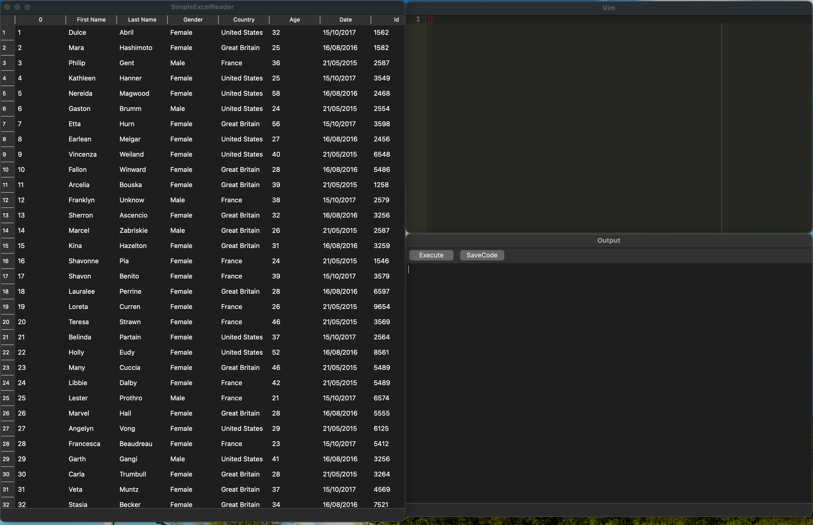
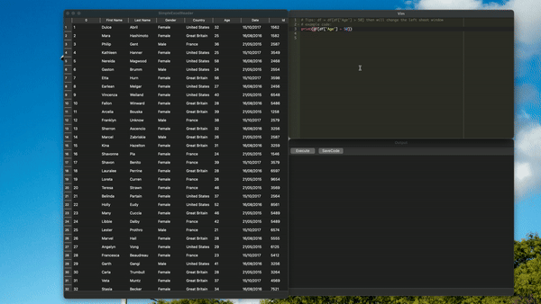

# SimpleExcelReader
* simple excel reader is a simple tool for reading excel files and processing Excel files with python script. 

# Feature
* Read Excel files
* Process Excel files with python script
* Save Excel files
* Support Windows, Linux, Mac
* Vim Editor

# Img

# Gif

